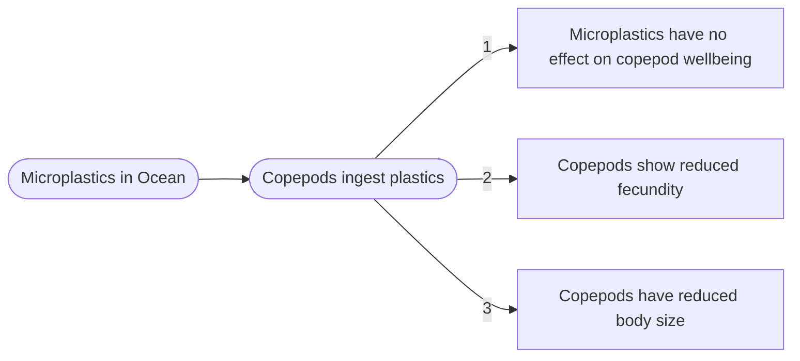

## Typora Formatting

**Make headers with varying numbers of hashtag 1-6 (bigger-smaller)**

# Header 1

## Header 2

### Header 3

#### Header 4

##### Header 5

###### Header 6


**Lists!**

Unordered List with `* ` `+` or `- `

* an item
* another item
* last item

Ordered List with numbers

1. First Item
2. Second Item
3. Third Item

**Line Break**

`Shift + Return` creates a single line break and add tw spaces at the end of the line  

You can also write `<br/>` at the end of a line to create a line break.  

**Links**

To insert links, put the link title or reference in square brackets followed immediately by another set of square brackets within which is the URL. 

Example:` [My Bio 381 Homepage][https://manalijrc.github.io/Rege-ColtBio381/]` will render as  [My Bio 381 Homepage][https://manalijrc.github.io/Rege-ColtBio381/] and take you to my website.

If you want a URL to be visible simply do `<URL>` .

**Images**

To insert an image in a Typora document, do ` `


**Block Quotes**

To create block quotes simply begin each new quote with `>`.

> This is a paragraph of text. I began the line with a `>` and it indented my line of words separate from the rest of the words in the document

> > Using two `>>` will indent the paragraph further

**Plain Code Blocks**

To create a block of plain code use 3 back ticks ` ``` ` 

```
This is a box of plain text.
```

**R Code Blocks**

To create a code block, use 3 back ticks followed by `{r}` to carify the language.

```{r}
# here is a comment
x <- 3
```

**In Line Block**

To create an in line block simply surround the desired characters with `1 back tick` like this or this `print()`

**In Line LaTeX equation**

To create an in line LaTeX equation, surround the equation with a single `$` like this `$3 + x = 4$` 

In this equation we show how an expression $3 + x = 4$. 

**Centered LaTeX Equation** 

To center the equation on the page use two consecutive dollar signs and then press enter,  type the desired TeX equation and in the next line close the block of centered TeX with another `$$` :

```R
$$
3 + x = 4
$$
```


$$
3 + x = 4
$$


**Horizontal Line**

Create a horizontal line page break by typing at least 3 consecutive underscores.

___

**Tables**

Create a simple table by typing `| First Column | Second Column |` followed by the Return key. 

| First Column | Second Column |
| ------------ | ------------- |
| content here | content here  |
| content here | content here  |

**Highlighting**

To highlight text, wrap desired text in a double equals sign, `==` for example `==highlight==`

==highlight==


**Flow Charts**

Hand-drawn flow chart:


**Flow chart by software:**




 

